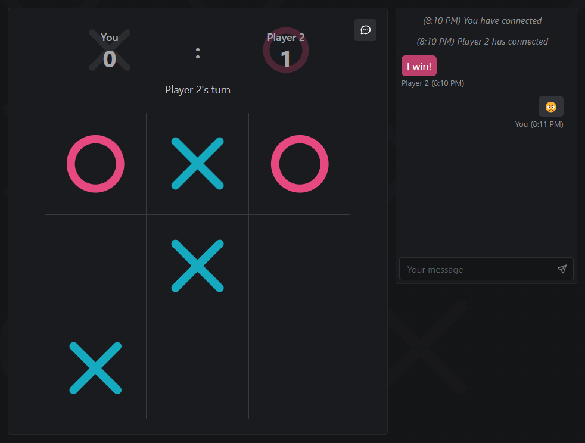

# 🕹️ Multiplayer Tic-Tac-Toe

Multiplayer Tic-Tac-Toe game in the browser, simply send a link to a friend to start playing. Includes integrated real-time chat. Play it [here](https://mwpryer-tic-tac-toe.up.railway.app/)!

    

## Features

- Play Tic-Tac-Toe with a friend in real-time
- Scoreboard to keep track of wins
- In-game chat to communicate with your opponent
- Optimized for both desktop and mobile use

## Technologies

The frontend is built with TypeScript, React, Mantine, and Tailwind CSS, and scaffoled using Vite. The backend is built with Node.js and Express. WebSockets are implemented with Socket.IO.
